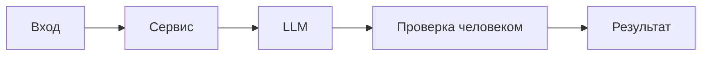

# ADR: решение для первого рабочего сценария

Файл ведёт OpenCode. Обсудите с агентом содержание и проверьте предложенный diff. Все дополнения и исправления поручайте агенту в чате.

- Статус: proposed / accepted
- Дата:
- Ответственные:

## Контекст

TRAINING_PR.diff добавляет простой сервис AI‑ревью без валидации входа/выхода, без лимита размера diff, без маскировки секретов и без таймаута для внешнего вызова LLM. Требования P1-03 задают минимальные нефункциональные правила (SEC/API/REL/OUT/OBS).

## Решение

Ввести минимальные контракты и защитные меры:
- API-1: отклонять diff > 20,000 символов с 413.
- SEC-1: маскировать секреты до вызова LLM.
- REL-1: ограничить вызов LLM таймаутом 10 с и возвращать контролируемый ответ при истечении.
- OUT-1: вернуть структурированный ответ summary+risks+checks (≤3 риска с file,line,evidence,risk).
- OBS-1: логировать только request_id, duration, status.

## Рассмотренные альтернативы

| Альтернатива | Почему не выбрали сейчас |
|---|---|
| Полное переписывание сервиса | Избыточно для первого сценария; цель — минимальные гарантии |
| Встраивание синхронной проверки стиля | Не решает риски SEC/REL/OBS |
| Асинхронная очередь и ретраи | Можно позже; сейчас достаточно таймаута и контролируемого ответа |

## Последствия и главный риск

- Положительные последствия:
- Улучшение стабильности API и предсказуемости интеграций; снижение рисков утечки секретов; контролируемые ошибки.
- Ограничения: возможные ложные срабатывания маскировки; ограничение размера входа; потенциальная деградация при частых таймаутах.
- Главный риск: неверная/неполная маскировка секретов.
- Как проверим риск: тестовые кейсы с шаблонами токенов и ключей; мануальная проверка промпта, отправляемого в LLM, через заглушку.

## Архитектурная схема

## Как использовали AI

- Для чего: зафиксировать минимальные решения под правила SEC/API/REL/OUT/OBS.
- Тип промпта: rules prompt.
- Строка в [`prompts.md`](prompts.md): P1-03.
- Что проверили и исправили сами: согласование с TRAINING_PR.diff и ограничениями первого сценария.
- Для чего:
- Тип промпта:
- Строка в [`prompts.md`](prompts.md):
- Что проверил студент и какие исправления поручил агенту:
