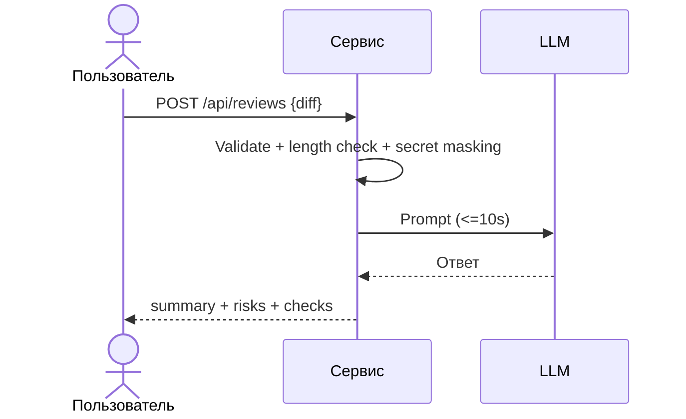

# Use cases и user stories

Файл ведёт OpenCode. Обсудите с агентом содержание и проверьте предложенный diff. Все дополнения и исправления поручайте агенту в чате.

## Первый рабочий сценарий

Когда разработчик или CI отправляет diff в POST /api/reviews, система валидирует тело, проверяет длину, маскирует секреты, вызывает LLM с таймаутом 10 секунд и возвращает структурированный ответ summary+risks+checks; пользователь получает стабильный контракт и контролируемые ошибки.

Не входит в этот сценарий:

- Выбор провайдера LLM и оптимизация качества ревью.
- Изменения в GitHub или автофиксы кода (SCOPE-1).

## Use case

| Поле | Значение |
|---|---|
| Актор | Разработчик/CI |
| Триггер | Отправка diff на ревью |
| Предусловия | Доступен API сервиса |
| Основной результат | Получен JSON с summary, risks (≤3), checks |
| Ошибка или отказ | 422 при невалидном теле; 413 при >20,000 символов; контролируемый ответ при таймауте LLM |



## User stories и acceptance criteria

```gherkin
Feature: AI review API

  Scenario: Успешное ревью
    Given корректное тело с diff <= 20000 символов
    When отправляем POST /api/reviews
    Then получаем 200 и JSON с полями summary, risks, checks

  Scenario: Слишком длинный diff
    Given diff длиной 20001 символ
    When отправляем POST /api/reviews
    Then получаем 413 Payload Too Large

  Scenario: Таймаут LLM
    Given провайдер LLM отвечает дольше 10 секунд
    When отправляем POST /api/reviews
    Then получаем контролируемый ответ о таймауте
```

## Как использовали AI

- Для чего: сформировать сценарии и критерии приемки по заданным правилам.
- Тип промпта: rules prompt.
- Строка в [`prompts.md`](prompts.md): P1-03.
- Что проверили и исправили сами: соответствие сценариев TRAINING_PR.diff и правилам SEC/API/REL/OUT.
- Для чего:
- Тип промпта:
- Строка в [`prompts.md`](prompts.md):
- Что проверил студент и какие исправления поручил агенту:
