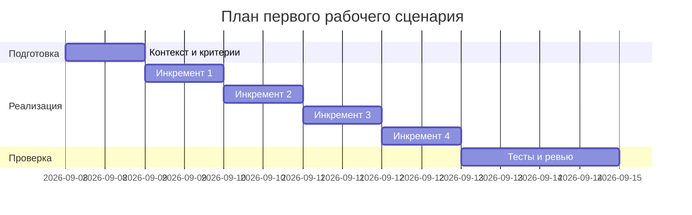

# План поставки

Файл ведёт OpenCode. Обсудите с агентом содержание и проверьте предложенный diff. Все дополнения и исправления поручайте агенту в чате.

## Инкременты и ответственность

| Инкремент | Наблюдаемый результат | Что делает человек | Что делает AI или субагент | Проверка | Зависимости |
|---|---|---|---|---|---|
| 1 | Валидация тела и лимит длины | Добавляет Pydantic-модель и проверку длины | Генерирует черновик модели/валидации | Интеграция: {} -> 422; 20001 -> 413 | FastAPI |
| 2 | Редактирование секретов | Настраивает правила маскировки | Генерирует список паттернов секретов | Юнит: секрет замаскирован до LLM | Правила безопасности |
| 3 | Таймаут и контролируемый ответ | Вводит таймаут 10с и обработку | Предлагает шаблон обертки вокруг LLM | Тест: медленный LLM -> контролируемый ответ | Провайдер LLM |
| 4 | Формат ответа и логи | Возвращает summary/risks/checks, настраивает логи | Генерирует схему ответа | E2E: контракт ответа; аудит логов | OBS-1 |

## Диаграмма Ганта

## Как использовали AI

- Для чего: наметить инкременты под правила SEC/API/REL/OUT/OBS.
- Тип промпта: rules prompt.
- Строка в [`prompts.md`](prompts.md): P1-03.
- Что проверили и исправили сами: сопоставили инкременты с рисками и проверками.
Передайте OpenCode даты и задачи своего плана и попросите обновить диаграмму.

## Как использовали AI

- Для чего:
- Тип промпта:
- Строка в [`prompts.md`](prompts.md):
- Что проверил студент и какие исправления поручил агенту:
